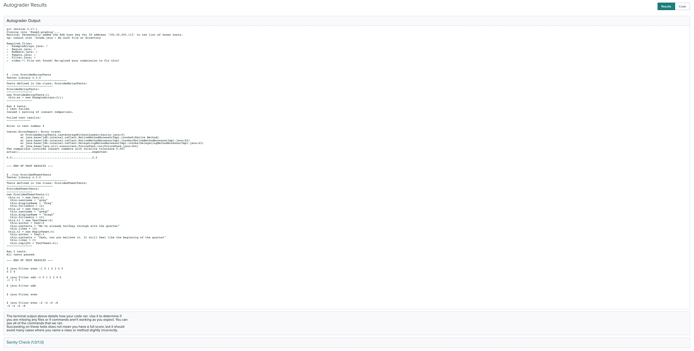
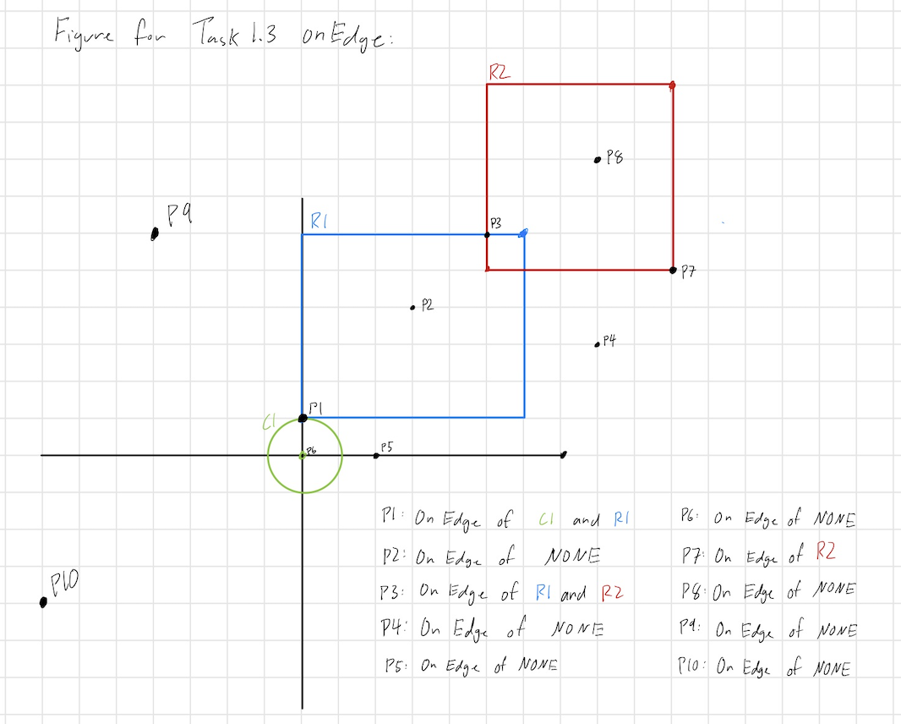

# Exam 2

### Release: 10am Friday Febuary 11, 2022
### Due: 10pm Saturday Febuary 12, 2022

**Note that this is released after class Friday, and is due the next day in the evening. We will not accept late submissions.**


This page details a take-home exam that you will complete over the next few
days. You can’t communicate with anyone about the content of the assignment
until you receive your grade. You can message us privately on Piazza, but the
course staff will not give programming advice or answer most questions, including clarifications, about the
problems. If you have technical trouble creating a screencast (detailed below)
feel free to reach out for assistance.

Do not use any online service other than Piazza to ask questions about the
assignment. Do not search for, solicit, or use solutions to the problems that
you find elsewhere for the exam. These are all violations of academic integrity
that students have committed on exams like this in the past.

You can make use of any course notes, online resources about Java and its
libraries, Java tools, and so on to complete the exam, including re-using code
from class notes.

You can review the grading policy for exams in the [syllabus](/syllabus.html).
You will complete the programming task below and submit your work to the `Exam2` Gradescope assignment.

Starter code is available here:

[https://github.com/ucsd-cse11-w22/cse11-exam2-starter](https://github.com/ucsd-cse11-w22/cse11-exam2-starter)

Submission checklist (see long descriptions below for full details):

- [ ]`ExamplesArrays.java`
- [ ]`Numbers.java`
- [ ]`Region.java`
- [ ]`Tweets.java`
- [ ]`Filter.java`
- [ ]`video.*` (`*` means whatever extension you have; we *really* prefer `mp4`, which is what Zoom produces. If you use an extension other than mp4, check that it plays in Gradescope!)

The starter code has been marked with the following annotation:

```java
// Task #.#: [Title]
// Your code here
```
You will only need to add code where you see this annotation.

Make sure to look at your Gradescope submission after submitting to see if all the required files are there.


### **Task 1-3 will be autograded and will make up most of the Exam 2 score. Task 4 will be manually graded.** 

Make sure that your submission passes autograder for your code to be properly graded. 

If you are having issues with getting the autograder to run successfully, you may find it helpful to consult the [Developing with the Gradescope Autograder in Mind](https://docs.google.com/document/d/1IKSDkG4kHC0gb2FyqdeOWJOAbQr6UCvYZSToIBopfVs/edit?usp=sharing) guide.

If your submission passes the autograder, then you should see output similar to:



Be aware that the Sanity check does not check for code correctness, but rather that your code compiles. 


Your submission will be graded **after** the deadline. You should test thoroughly yourself to make sure your program works as expected.

## Clarifications

**Can I use a Java feature/library/method that we haven't covered in class?**

Yes, just make sure it doesn't break the autograder. The course staff is not responsible for fixing any submissions that fail the autograder during or after the exam. 

**Can we write more methods than specified?**

Yes, you can write additional helper methods.

**Can I use previous code that I wrote for a PA in my exam?**

Yes.

**What does thread mean for Tweets?**

Use the definition in [PA4](https://ucsd-cse11-w22.github.io/assignments/pa4.html)


## Task 1 – Arrays
You will be writing the majority of your code in `ExampleArrays.java`, however several tasks will require you to modify other files. We have provided some code in the file `Region.java`.

### Task 1.1
In the `ExampleArrays` class, you will use the design recipe to write a method called `averageWithoutLowest` that takes a `Number[]` as an argument and returns a `Number` that represents the average of all the numbers in the `Number[]`, except the lowest. If the input `Number[]` contains a single `Number`, return the `Number` itself. If the input `Number[]` is empty, return a `Number` representing the integer `0`. We will not test `Number` objects that represent negative numbers so you may ignore this case. The `Number[]` tested will not contain numbers that will cause Integer overflow.

To assist you in your task, you will modify the `Number` interface, located inside `Numbers.java`. In addition to all the methods that were written in PA4, you will add an additional method to the `Number` interface and modify the classes that implement `Number`. That method will be called `compare` and it will take a `Number` as an argument and will return an integer. 

Your `compare` method will behave as follows:

- Case 1: If `this` is numerically greater than `other`, then return `1`
- Case 2: If `this` is numerically lesser than `other`, then return `-1`
- Case 3: If `this` is numerically equal to `other`, then return `0`

### Task 1.2
In the `ExampleArrays` class, you will use the design recipe to write a method called `sumPairs` that will take 2 `Pair[]` as arguments and return a `Pair[]`. Each element of the returned `Pair[]` will be the result of adding both `Pair` objects at the same index in the 2 `Pair[]` given as arguments. If the 2 `Pair[]` are of different lengths, then you will sum the pairs up to the final pair of the shortest `Pair[]`. You may safely ignore the remaining `Pair` objects of the longer `Pair[]`. If any `Pair[]` is empty, then you will return an empty (length of 0) `Pair[]`.

In the file `ExampleArrays.java`, you will add a new class **OUTSIDE** the `ExampleArrays` class called `Pair`. It will have two fields of type int called `a` and `b`. It's constructor will initialize both fields to be the value as specified by the arguments given to the constructor.

Adding 2 `Pair` objects means to sum their `a` fields together and to sum their `b` fields together

### Task 1.3
In the `ExampleArrays` class, you will use the design recipe to write a method called `onRegionEdge` that will take a `Region[]` and `Point` as arguments and return a `Region[]`. The resulting `Region[]` will consist of all regions where the `Point` given as argument lies on the edge of the region. If the `Region[]` given as argument is empty, return an empty `Region[]`.

To assist you in your task, you will modify the `Region` interface, located inside `Region.java`. In addition to all the methods provided, you will add an additional method to the `Region` interface and modify the classes that implement `Region`. That method will be called `onEdge` and will take a `Point` as an argument and return a `boolean`. It will return `true` if the `Point` given as argument lies on the edge of `this` region, otherwise it will return `false`.

A `Point` is on the edge of a `RectRegion` if the point lies on the outline of the rectangle defined by the `RectRegion`. A point is on the edge of a `CircRegion` if it is on the line described by the circle's circumference. You may refer to the following figure for a visual representation of this idea.



Figure 1: Notice that `Point` p1 is on the edge of both `R1` and `C1`. Being on the corner of `R1` still counts as being on the edge. 

There are no specific test requirements for these methods other than the one
listed in the video below; we will test them to ensure they are correct and you
should test them thoroughly enough to be confident in their correctness.

Here are some tests to get you started that you can use as you like (and to help make sure we agree on how these methods work). These tests have been provided in `Sanity.java` for your convenience.

``` java
class ProvidedArrayTests {
    ExampleArrays ea = new ExampleArrays();

    void testAverageWithoutLowest(Tester t) {
	Number[] test1 = {new WholeNumber(1) , new Fraction(4, 2), new WholeNumber(3)};
		
        t.checkExpect(ea.averageWithoutLowest(test1).toDouble(), 2.5);
    }

    void testSumPairs(Tester t) {
        Pair[] p1 = {new Pair(1,2), new Pair(3,4), new Pair(5,6)};
        Pair[] p2 = {new Pair(1,2), new Pair(3,6)};

        Pair[] expect_p1_p2 = {new Pair(2, 4), new Pair(6, 10) };
        Pair[] result_p1_p2 = ea.sumPairs(p1, p2);
        
        t.checkExpect(result_p1_p2, expect_p1_p2);
    }

    void testSumPairsEmpty(Tester t) {
        Pair[] p1 = {new Pair(1,2), new Pair(3,4), new Pair(5,6)};
        Pair[] p2 = new Pair[0];

        Pair[] expect_p1_p2 = new Pair[0];
        Pair[] result_p1_p2 = ea.sumPairs(p1, p2);

        t.checkExpect(result_p1_p2, expect_p1_p2);
    }

    void testOnEdge(Tester t) {
        Region[] r1 = {new RectRegion(new Point(0,1), new Point(6,6)), new CircleRegion(new Point(0, 0), 1), new RectRegion( new Point(5,5), new Point(10, 10))};
        
        Region[] expect_r1 = {new RectRegion(new Point(0, 1), new Point(6, 6)), new CircleRegion(new Point(0, 0), 1)};
        Region[] result_r1 = ea.onRegionEdge(r1, new Point(0,1));

        t.checkExpect(result_r1, expect_r1);
    }
}
```

## Task 2 – Interfaces

We've provided code for `Tweet`, `ReplyTweet`, and `TextTweet` and several
related classes that we've used for PAs in `Tweets.java`.

### Task 2.1
In `Tweets.java`, you will add a method called `mostPopularAuthorOnThread` to the `Tweet` interface and all implementing classes. `mostPopularAuthorOnThread` takes no arguments and returns a `User` representing the most popular author on thread as determined by their number of followers. If two authors share the same number of followers, then you will return the author that appears later on the thread.

For `TextTweet`, return the author of the `TextTweet`. For `ReplyTweet`, return the most popular author of the thread, as described above, with `this ReplyTweet` as the latest tweet in the thread. 

### Task 2.2
In `Tweets.java`, you will add a method called `shortestTweetOnThread()` to the `Tweet` interface and all implementing classes. `shortestTweetOnThread` takes no arguments and returns a `Tweet` representing the tweet with the shortest amount of text content. If two tweets share the same amount of text content, then you will return the tweet that appears later on the thread.

For `TextTweet`, return `this` object itself. For `ReplyTweet`, return the shortest `Tweet` of the thread, as described above, with `this ReplyTweet` as the latest tweet in the thread. 

There are no specific test requirements for these methods other than the one
listed in the video below; we will test them to ensure they are correct and you
should test them thoroughly enough to be confident in their correctness.

Here are a few tests to get you started (and make sure we all agree how this
should work). These tests have been provided in `Sanity.java` for your convenience.

Note that in the following thread the latest tweet is `t2` since it is replying to t1.

```java
class ProvidedTweetTests {
    User u1 = new User("greg", "Greg", 12);
    User u2 = new User("greg2", "Greg2", 12);

    Tweet t1 = new TextTweet("We're already halfway through with the quarter", u1, 12);
    Tweet t2 = new ReplyTweet("Yeah, can you believe it. It still feel like the beginning of the quarter", u2, 13, t1);

    void testMostPopularAuthorOnThread(Tester t) {
        t.checkExpect(t2.mostPopularAuthorOnThread(), u2);
    }

    void testShortestTweetOnThread(Tester t) {
        t.checkExpect(t2.shortestTweetOnThread(), t1);
    }
}
```

## Task 3 – Main and Command-Line Arguments

Your task is to write a program in `Filter.java` will filter an array of integers based on a given command option. 

Your program will have to support 2 command options and have the described behavior:
- `even` - prints out a list of all the even integers provided as argument
- `odd` - prints out a list of all odd integers provided as argument

Filter will always have either `even` or `odd` as the first argument and have either none or some integers as command line arguments. 

If there are zero integers provided as command line arguments, print **nothing** (not even a new line)

```
$ javac Filter.java
$ java Filter even -1 0 1 2 3 4 5
0 2 4
$ java Filter odd -1 0 1 2 3 4 5
-1 1 3 5
$ java Filter odd
$ java Filter even
$ java Filter even -2 -4 -6 -8
-2 -4 -6 -8
```

## Video Task

You will record a short video of no more than 6 minutes. 

Tip: If you find yourself running out of time, you might be explaining your code too much. If the task does not ask you to directly explain your code, you don't need to explain it. 

Include:

- Show only your face and a picture ID (your student ID is preferred but any
picture ID with your name on it will work) for a few seconds at the beginning.
You don’t have to be on camera the whole time, though it’s fine if you are. Just
a brief confirmation that it’s you creating the video/doing the work attached to
the work itself is what we want. If you do not have a webcam, take a picture of
yourself (and your picture ID) with your phone and display that picture at the
start of your screen share.
- `averageWithoutLowest`
  - Choose an example of calling `averageWithoutLowest` with an array of at length
  4 where the lowest element is not the first or last element in the array.
  - Write down a table corresponding to **one** loop you wrote in the body of
  the method that shows, for **all** variable(s) involved in the loop, what its value is at the start and
  end of each loop iteration. Write your table in a comment next to the loop, as
  shown in the example below.
  - You may write the Number objects using their "toText()" representation. That means that you may write `WholeNumber` as `n` and `Fraction` in the form `n/d`. 
  - You may pre-write the header row of the table, but you **must** fill in the
  contents of the table on the video. As you fill in the “end” value for each
  variable, indicate which statement(s) in the program caused its value to
  change.
  - If a `return` statement happens in the loop, note that in the row as well.

  ```
  int a = 0;
  int z = 0;
  for(int i = 1; i < 6; i += 2) {
    z += i;
  }
  /*
  i start   i end   z start   z end
  1      	  3       0         1
  3         5       1         4		
  5         7       4         9
  */
  ```


- Choose a test that you wrote on your own for `shortestTweetOnThread` where the thread has at least 2 `ReplyTweet`s and 1 `TextTweet`. You will need to write this test outside of your testing methods and store the result in a field. Run the program and show the output for that object, and the objects it references, at the terminal. 

    Then, next to the example, describe the stack in a comment, where in each line you indicate:
  - The *class* of the method called
  - The *name* of the method called
  - The *reference* of the `this` parameter (the reference numbers do not need to be consistent with what `./run` gives, but they should be consistent with the order of the objects)
  - The *return value* of that method call. Use reference numbers here.

  Put the call that happens first on the last line of your stack trace (so it's
  at the bottom, as we've drawn in problem sessions and in the notes and
  videos). Only include calls to the `shortestTweetOnThread` method. If you include any more methods, you will have points deducted. 

  You may prepare the table header (class, method, reference number, return value) prior to your video, but the table itself **must** be filled in during your video.

  You may abbreviate class names as long it is obvious what class the abbreviation is referring to.

  As an example, consider this program, output, and test:

  ```
  interface I { boolean m(); }
  class C { public boolean m() { return false; } }
  class D {
    I i;
    D(I i) { this.i = i; }
    public boolean m() { return !this.i.m(); }
  }
  class Examples {
    C c = new C();
    C c2 = new C();
    D d1 = new D(this.c);
    D d2 = new D(this.c2);
    D d3 = new D(this.d1);
    boolean ans1 = this.d2.m();
    boolean ans2 = this.d3.m();
    /*

    class	method  reference   return value
    C     m       :1          false
    D     m       :2          true
    D     m       :3          false
    */
  }
  $ ./run Examples
  Tester Library v.3.0
  -----------------------------------
  Tests defined in the class: Examples:
  ---------------------------
  Examples:
  ---------------
  new Examples:1(
   this.c = new C:2()
   this.c2 = new C:3()
   this.d1 = new D:4(
    this.i = C:2)
   this.d2 = new D:5(
    this.i = C:3)
   this.d3 = new D:6(
    this.i = D:4)
   this.ans1 = true
   this.ans2 = false)
  ---------------
  No test methods found.
  ```

