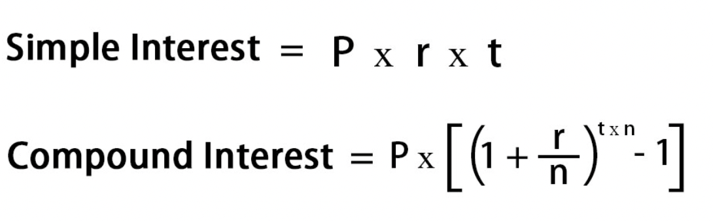

# Final Exam

### Release: 8am Tuesday March 15, 2022
### Due: 8am Friday March 5, 2022


This page details a take-home exam that you will complete over the next few
days. You can’t communicate with anyone about the content of the assignment
until you receive your grade. You can message us privately on Piazza, but the
course staff will not give programming advice or answer most questions, including clarifications, about the
problems. If you have technical trouble creating a screencast (detailed below)
feel free to reach out for assistance.

Do not use any online service other than Piazza to ask questions about the
assignment. Do not search for, solicit, or use solutions to the problems that
you find elsewhere for the exam. These are all violations of academic integrity
that students have committed on exams like this in the past.

You can make use of any course notes, online resources about Java and its
libraries, Java tools, and so on to complete the exam, including re-using code
from class notes.

You can review the grading policy for exams in the [syllabus](/syllabus.html).
You will complete the programming task below and submit your work to the appropriate Gradescope assignment for each part of the exam.

Starter code is available here:

[https://github.com/ucsd-cse11-w22/cse11-finalexam-starter](https://github.com/ucsd-cse11-w22/cse11-finalexam-starter)

The starter code will contain 3 folders, each of which will be labeled and will contain starter code corresponding to that portion of the Final Exam.

The starter code has been marked with the following annotation:

```java
// Task #.#: [Title]
// Your code here
```
You will only need to add code where you see this annotation.

Make sure to look at your Gradescope submission after submitting to see if all the required files are there.


### **All coding tasks will be autograded.** 

Make sure that your submission passes autograder for your code to be properly graded. 

If you are having issues with getting the autograder to run successfully, you may find it helpful to consult the [Developing with the Gradescope Autograder in Mind](https://docs.google.com/document/d/1IKSDkG4kHC0gb2FyqdeOWJOAbQr6UCvYZSToIBopfVs/edit?usp=sharing) guide.

If your submission passes the autograder, then you should see output similar to:


Be aware that the Sanity check does not check for code correctness, but rather that your code compiles. 

Your submission will be graded **after** the deadline. You should test thoroughly yourself to make sure your program works as expected.

## Clarifications

**Can I use a Java feature/library/method that we haven't covered in class?**

Yes, just make sure it doesn't break the autograder. The course staff is not responsible for fixing any submissions that fail the autograder during or after the exam. 

**Can we write more methods than specified?**

Yes, you can write additional helper methods.

**Can I use previous code that I wrote for a PA in my exam?**

Yes.

## Final Exam - Part 1
This part of the final corresponds to Exam 1 material. A set of incomplete tests will be provided in Sanity.java.

You will submit the following files to the `Final Exam - Part 1` Gradescope assignment:
- [ ] `Interest.java`
- [ ] `Bank.java`
- [ ] `video.*`

### Task 1 – Interest Calculation
In the `Interest` class in `Interest.java`, you will use the design recipe to write two methods:

- `simpleInterest`, which takes three doubles representing the principal amount, rate of interest(%) and time period (in years) and returns the simple interest(double). Round off the result to 2 decimal places.

- `compoundInterest`, which takes four doubles representing the principal amount, rate of interest(%), time period (in years), n(months/yr) and returns the compound interest(double). Round off the result to 2 decimal places. Recall that the interests are given by 



Note that it’s fine to add more methods than what we’ve listed, but these two methods must appear as described.

Note that you should use the full design recipe – include enough examples to convince yourself the method works

### Task 2 – Bank Account Modelling

You will complete the following tasks in `Bank.java`.

In `Bank.java`, you will add:
- A new class called Customer that represents a particular customer of the bank.
- The customer must have an `int` field called `id` representing the Customer's id, a `String` field called `name` representing the Customer's name, and `String` field called phone representing the Customer's phone number.
- A constructor for Customer that takes arguments `id`, `name`, and `phone` in that order.

In the class `Account`, you will add:
- A new field of type `Customer` in Account that represents the `Customer` holding the account.
- Add `Customer` as the last parameter of the Account constructor.
- A new method in `Account` named `deposit` that takes a `double` as an argument and updates the balance in the account by adding the deposit amount. Return a string stating  "`Deposit successful`". Do not inlude the double quotes in your answer.
- A new method in `Account` named `withdraw` that takes a `double` as an argument and updates the balance in the account by subtracting the deposit amount if there is sufficient balance. Return a string stating "`Withdrawal successful`". In case there is no sufficient balance, return a string stating "`Insufficient balance`". Do not update the balance in this case.

In the class `Bank`, you will add and save to a field:
- At least 1 `Customer` object
- At least 1 `Account` object
- At least 1 example of the `deposit` method
- At least 2 examples of the `withdraw` method, where at both cases must be shown.

Note that If you do not name these fields exactly, you will fail the autograder.

### Video Task

You will record a short video of no more than 5 minutes. 

Tip: If you find yourself running out of time, you might be explaining your code too much. If the task does not ask you to directly explain your code, you don't need to explain it. 

Include:

- Show only your face and a picture ID (your student ID is preferred but any
picture ID with your name on it will work) for a few seconds at the beginning.
You don’t have to be on camera the whole time, though it’s fine if you are. Just
a brief confirmation that it’s you creating the video/doing the work attached to
the work itself is what we want. If you do not have a webcam, take a picture of
yourself (and your picture ID) with your phone and display that picture at the
start of your screen share.

- Take an example for the compoundInterest method, and explain how the program works. Highlight all of the lines of code that evaluate when that example runs; mark those lines with a comment at the end of the line as you go.
- Highlight the 2 examples you wrote for withdraw method. Highlight all of the lines of code that evaluate when one of those examples runs.
- Be sure to verbally explain your steps as you complete the above task.

## Final Exam - Part 2

This part of the final corresponds to Exam 2 material. A set of incomplete tests will be provided in Sanity.java.

You will submit the following files to the `Final Exam - Part 2` Gradescope assignment:
- [ ] `Mode.java`
- [ ] `Prime.java`
- [ ] `ToText.java`
- [ ] `video.*`

### Task 1 - Mode

In the class `Mode` in `Mode.java`, you will write a single method called `mode` that takes an `int[]` as argument and returns the `int` mode of the `int[]`. If there are ties about which the mode is, you may return either mode. If there are no elements in the `int[]`, then you will return `0`.

Mode is defined as the number that appears the most amount of times.

### Task 2 - Prime Numbers

In the class `Prime` in `Prime.java`, you will write a `main` method that will read non-negative `int`s from the command line and will print (on a new line) each `int` that is prime. If there are no `int` passed to your program from the command line or if there are no prime integers, print nothing, not even a new line. 

To assist you in this task, we have provided a helper method `isNumPrime` that will determine whether or not an `int` is prime. 

### Task 3 - ToText

In the file `ToText.java`, we have provided code for the `Region` interface and 4 classes that implement `Region`. You task will be to add a `toText()` method to the `Region` interface and implement it in all 4 classes. 

- For RectRegion, return the string `Rectangle`
- For CircleRegion, return the string `Circle`
- For UnionRegion, return the string `Union(<region1>, <region2>)`
- For IntersectRegion, return the string `Intersect(<region1>, <region2>)`

For both UnionRegion and IntersectRegion, `<region>` corresponds to the `toText()`representation of that corresponding region.

Note that you must match this exactly, meaning that the tester will be case sensitive and space sensitive. 

### Video Task
Create a video of no more than 5 minutes:

- Show your ID as usual
- Run an example of `mode` where the mode is not the first or last element in the array. Show the output, then write a loop table of a single loop in the body of `mode` showing each variable's value before and after each loop iteration. Put this table as a comment and follow the same format as described in the video task for [Exam 2](https://ucsd-cse11-w22.github.io/assignments/exam2.html)
- Be sure to verbally explain your steps as you complete the above task.
- There is no video task associated with Task 2 and Task 3

## Final Exam - Part 3
This part of the final corresponds to Exam 3 material. A set of incomplete tests will be provided in `Sanity.java`.

You will submit the following files to the `Final Exam - Part 3` Gradescope assignment:
- [ ] `Sum.java`
- [ ] `Occurrence.java`
- [ ] `video.*`

### Task 1 - Sum

Consider the following interface:
```java
interface Summable<T> {
    int getVal(T t);
}
```

In the class `Sum`, you will write a non-static generic method called `sum` which will take as its first argument a generic `List` and a generic `Summable` object. It will return a single `int` representing the sum of all the elements in the list. 

If there are no elements in the list or if any of the arguments are `null`, return `0`.

### Task 2 - Occurrence

In the class `Occurrence` in `Occurrence.java`, you will write a program that will take text file names as command line arguments and print out the word that occured the most times across all text files along with the number of times the word occured. You should print out each pair of values in the form `word, occurrences`. If there are ties, then print all the ties (in any order). If no text file names are given or all text files are empty, then print nothing, not even a new line.

### Video Task

Create a video of no more than 5 minutes:

- Show your Face and ID as usual
- For `sum`, write a new example where `List` and `Summable` use some custom type that you define and there are at least 3 elements in the `List`. Draw a stack trace of all the active method calls as your program sums up the second element in the `List`. Note, this means that the `getVal` method will be in the process of executing. Follow the same format as described in the video task for [Exam 3](https://ucsd-cse11-w22.github.io/assignments/exam3.html)
- Be sure to verbally explain your steps as you complete the above task.
- There is no video task associated with Task 2
