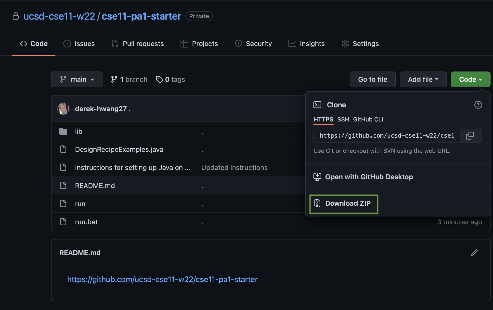

# CSE 11 Programming Assignment 1

### Due Dates: Tuesday, October 5, 10:00PM Pacific Time

## Learning Goals
- Set up and test your Java development environment
- Write functions that take integer parameters and return integer results.
- Practice using design recipes

## Collaboration

Different assignments in this course have different collaboration policies.

On this assignment, you can collaborate with **anyone in the course**, including
**sharing code**. Feel free to offer help to other students, converse about the
*assignment, and so on.

In your submission, give credit to all students and course staff who helped you
with this assignment by noting their name and how you used their ideas or work.
Note that using someone's work without giving credit to them is a violation of
academic integrity.

## Part 1- Setting Up

- **On your own computer**: General instructions for setting up your environment can be found in [this document](https://github.com/ucsd-cse11-f21/cse11-pa1-starter/blob/main/Instructions%20for%20setting%20up%20Java%20on%20your%20own%20machine.pdf). There are specific video tutorials for [Windows](https://drive.google.com/file/d/1FxIAaGj7JAAN5QNpqcx1JBdv36yzX6TX/view?usp=sharing)  and [Mac](https://drive.google.com/file/d/1EsF6t_ZA7TIdQ0iIu9X_dh1T5YGmzxNG/view?usp=sharing).
- **In the CSE Labs**: Watch and follow the instructions from this video: [this video](https://drive.google.com/file/d/1LGvWU4jaMXDam9sGPO6oHXDMpZumOOhC/view). In text form, the instructions are:
  - If the lab computer is showing a Windows deskto or login, restart it and
    choose CentOS (first option) on the screen you get when it starts up.
  - Locate your CSE11 account, which you can find using the ACMS account lookup tool:
    [https://sdacs.ucsd.edu/~icc/index.php](https://sdacs.ucsd.edu/~icc/index.php).
    The username starts with "cse11fa21”. You will need to do an initial password
    reset, which you only need to do once. It may take up to 20 minutes for the new
    password to be effective.
  - Once you are logged in, you can follow the instructions for using Visual
  Studio Code to get fully set up

If you get stuck at any point, do any one of the following:
  - Take a screenshot and ask on Piazza! (Not sure how to take a screenshot? Try Googling it for your particular platform, like “screenshot microsoft windows” or “screenshot chromebook” or “screenshot os x”, or ask how on Piazza and we can help.)
  - [Ask for help!](https://ucsd-cse11-f21.github.io/staff-and-help.html)

## Running Code

Download the starter code for this assignment by downloading this repository
using the “Download ZIP” button:
[https://github.com/ucsd-cse11-f21/cse11-pa1-starter](https://github.com/ucsd-cse11-f21/cse11-pa1-starter)

{:width="100%"}

Unzip the directory you downloaded, and open it in Visual Studio Code.

Create a new file named `FirstExample.java`, and put the following code into
that file (you can copy-paste):

```
class FirstExample {
  int theNumberFive = 5;
}
```

Open the terminal, then run your program using `./run FirstExample` (Mac, Lab)
or `.\run.bat FirstExample` (Windows). Finally, take a screenshot of your
terminal (including the commands you ran to compile and run the code).

Then, make a copy of the [writeup
template](https://docs.google.com/document/d/1wGIw0DH433jikfImoTUZZGMU9kTOzIf3/edit?usp=sharing&ouid=101937787285726759641&rtpof=true&sd=true),
answer the questions (including your screenshot).


## Part 2 - Writing Methods

- You will write your code in DesignRecipeExamples.java. You can run the code to test it yourself with:

    Mac and Lab:     ```./run DesignRecipeExamples```
    Windows:         ```.\run.bat DesignRecipeExamples```
- For problem 3 and 4, you will use the following design recipe:
    1. Write the method header
    2. Write a short comment documenting the method (including assumptions, like if a parameter should take values only in a certain range)
    3. Write examples of calling the method
    4. Write the method body
    
    Using this recipe for problems 1 and 2 is optional, but highly encouraged.

*(Several of these examples are borrowed from [How to Design Programs](http://www.htdp.org/2003-09-26/Book/curriculum-Z-H-6.html#node_sec_3.3), and its [Supplemental Material](http://www.htdp.org/2003-09-26/Problems/2.html))*

## Problem 1: Perimeter 
Develop a method named ```perimeter``` that when given the width and height of a rectangle will return its perimeter.

The rubric we will use to grade this method is:

- The method has a correct header (parameters and return type)
- The method has a correct method body
- There are at least two examples of calling the method with different arguments, commented with their expected values
- In the file `transcript.txt`, show your program running and the expected values are produced by copy/pasting from the terminal.

## Problem 2: Border Area
Develop a method named ```borderArea``` that given a width and height describing a rectangle, and another width and height describing a rectangle cut out of the center of the other, returns the area of the region between them. For example, the blue area in this shape:


- The method has a correct header (parameters and return type)
- The method has a correct method body
- There are at least two examples of calling the method with different arguments, commented with their expected values
- In the file `transcript.txt`, show your program running and the expected values are produced by copy/pasting from the terminal.

## Problem 3: Converter 
### Implementation
Develop a method (with a name of your choice!) that takes one int parameter, converts it to another int value, and returns the new int value. For example, your function could convert:
- Fahrenheit to Celsius
- between currencies

Write a comment for your method, describing what it does and what parameter it takes. If you use any outside sources for the conversion, be sure to cite those in the comment as well.

### Testing
Call your method on at least 3 different examples. Compare each result against a reference converter (Many search engines have built-in converters, or you can use a calculator) and add a comment above the function call to discuss differences (if any) that you get between your program and the reference.

- The method has a correct header (parameters and return type)
- The method has a method body that matches the examples you chose
- There are at least two examples of calling the method with different arguments, commented with their expected values
- In the file `transcript.txt`, show your program running and the expected values are produced by copy/pasting from the terminal.
- You can justify the output based on an external source or your own design description

## Problem 4: Combiner 
### Implementation
Develop a method (with a name of your choice!) that takes at least two int parameters, combines them to another int value, and returns the new int value. For example, your function could combine:
- Feet and inches into total in inches
- Starting hour and minute and end hour and minute into total number of minutes

Write a comment for your method, describing what it does and what parameters it takes. If you use any outside sources, be sure to cite those in the comment as well.

### Testing
Call your method on at least 3 different examples. Can you call your method with arguments that run, but produce an incorrect output? Call your method with at least one such pair of arguments, and add a comment above it explaining why the output is incorrect. If you cannot find such a pair of arguments, write a comment explaining why you believe no such input exists.

- The method has a correct header (parameters and return type)
- The method has a method body that matches the examples you chose
- There are at least two examples of calling the method with different arguments, commented with their expected values
- In the file `transcript.txt`, show your program running and the expected values are produced by copy/pasting from the terminal.
- You can justify the output based on an external source or your own design description


## Submission

Your submission will be in a few parts.

1. A PDF writeup demonstrating your setup. You can find a [template for the writeup here](https://docs.google.com/document/d/1wGIw0DH433jikfImoTUZZGMU9kTOzIf3/edit?usp=sharing&ouid=101937787285726759641&rtpof=true&sd=true). You will submit a PDF you create by filling in and downloading this document as PDF. Please submit your writeup to the [PA1 PDF assignment](https://www.gradescope.com/courses/310514/assignments/1515919).
2. A code submission of your program with the methods you wrote for part two, at [PA1 code gradescope assignment](https://www.gradescope.com/courses/310514/assignments/1511659). You should select and upload the files `DesignRecipeExamples.java` and `transcript.txt`

## Grading

To get your work graded, come to any [remote help hours session](https://ucsd-cse11-f21.github.io/staff-and-help.html) after submitting both Gradescope assignments. A tutor will grade and give you feedback on your work during the session, and tell you anything you need to fix to get full credit. (If you just submit to Gradescope and don't come to a remote help session to get your work checked off, we will still grade your work, but you'll miss out on the opportunity for feedback).

To earn a **2**:
- Demonstrate via screenshots in your PDF a working setup of Java either in labs or on your own computer
- Answer all questions in the PDF submission
- Complete all checklist items for all methods

To earn a **1**, submit something but miss any of the requirements listed above for earning a **2**.
